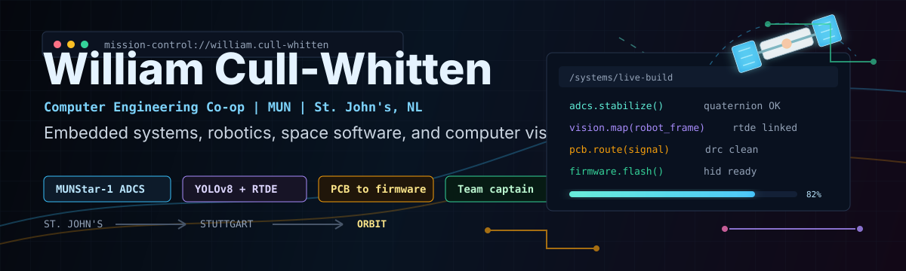
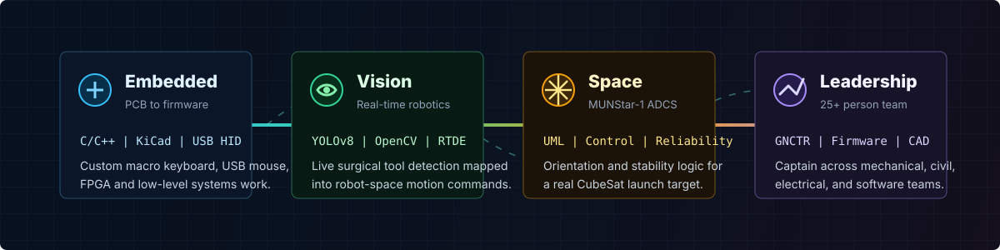

<a href="https://williamcullwhitten.ca">
  
</a>

<p align="center">
  <a href="https://williamcullwhitten.ca"></a>
</p>

<p align="center">
  <a href="https://www.linkedin.com/in/william-cull-whitten/"></a>
  <a href="mailto:ccullwhitten@mun.ca"></a>
  <a href="https://drive.google.com/uc?export=download&id=1jotTueDeHOBT6SFut46qUV3GU0oZKGZv"></a>
</p>

<p align="center">
  
  <a href="https://github.com/WilliamCW-Codes?tab=followers"></a>
  
</p>

<p align="center">
  
</p>

---

<table>
<tr>
<td width="62%" valign="top">

## `$ mission-brief`

**BEng Computer Engineering (Co-op), Memorial University of Newfoundland**  
Sept 2022 - May 2028

I build hardware-aware software: firmware that has to hit real pins, vision systems that have to move robots, and control logic that has to behave when the system leaves the bench.

**Currently focused on**

- MUNStar-1 ADCS software for a real CubeSat launch target
- Real-time YOLOv8 and RTDE robotics pipelines from my Germany co-op
- NexPad, a custom macro keyboard from PCB layout to firmware
- GNCTR systems leadership as captain of a 25+ person engineering team

**→ The full write-ups, demos, and case studies live at [williamcullwhitten.ca](https://williamcullwhitten.ca).**

</td>
<td width="38%" valign="top">

## `$ status`

```text
LOCATION     St. John's, NL
FOCUS        Embedded + robotics
MODE         Co-op + build mode
OPEN TO      Co-ops + internships
SIGNAL       Hardware-aware software
```

<p align="center">
  
</p>

</td>
</tr>
</table>

<p align="center">
  
</p>

---

## `$ ls ~/featured-projects`

<table>
<tr>
<td width="50%" valign="top">

### Surgical Vision → UR Robot Control
**Germany co-op, Furtwangen University**

YOLOv8 inference on a live camera feed, mapped from vision-space into UR robot-space motion commands over RTDE. Includes the operator UI and controller layer.

`Python` `YOLOv8` `RTDE` `OpenCV` `Robotics`

[](https://github.com/WilliamCW-Codes/Germany-WT-UniversialRobot-UI-and--Controller)

</td>
<td width="50%" valign="top">

### Portfolio Website
**The full case-study site**

Every project here, in depth: the decisions, the failures, the schematics, and the demos. Built and deployed by me.

`JavaScript` `Web` `Design` `Deployment`

[](https://williamcullwhitten.ca)
[](https://github.com/WilliamCW-Codes/Portfolio-Website)

</td>
</tr>
<tr>
<td width="50%" valign="top">

### Toboggan Headlight Firmware
**Competition embedded systems, 2024 + 2025**

Lighting and driver electronics firmware for MUN's GNCTR concrete toboggan, written to survive a race run on a ski hill.

`C++` `Embedded` `PCB` `Automotive`

[](https://github.com/WilliamCW-Codes/TBOG-Headlights-2025)
[](https://github.com/WilliamCW-Codes/TBOG-Headlights-2024)

</td>
<td width="50%" valign="top">

### Tetriduino
**Award-winning Arduino game system**

Tetris-style game with Python game logic driving Arduino hardware controls. Winner of the Outstanding Project of ENGI 1020 Award.

`Python` `C++` `Arduino` `Hardware`

[](https://github.com/WilliamCW-Codes/Tetridunio)

</td>
</tr>
</table>

<p align="center">
  <a href="https://github.com/WilliamCW-Codes?tab=repositories"></a>
  <a href="https://github.com/WilliamCW-Codes/MUN-TBOG-Website"></a>
</p>

---

## `$ ps aux --workbench`

Hardware builds in progress. Repos open as they hit first working firmware.

<table>
<tr>
<td width="33%" valign="top">

### NexPad

```text
TYPE      Custom macro keyboard
SCOPE     PCB layout to firmware
STATUS    In progress
```

`C` `KiCad` `USB HID` `Firmware`

</td>
<td width="33%" valign="top">

### NexClick

```text
TYPE      Custom USB mouse
SCOPE     Hardware, firmware, driver
STATUS    In progress
```

`C` `KiCad` `USB HID` `Embedded`

</td>
<td width="33%" valign="top">

### RISC-V Decoder

```text
TYPE      RV32I instruction decoder
SCOPE     Parsing + disassembly
STATUS    In progress
```

`C/C++` `Assembly` `Computer Arch`

</td>
</tr>
</table>

---

## `$ cat experience.log`

<table>
<tr>
<td width="23%" align="center" valign="top">

<br><sub><b>AI & Robotics Co-op</b></sub>
<br><sub>Furtwangen University</sub>
</td>
<td width="77%" valign="top">

**Built a real-time surgical tool detection system** using YOLOv8 on a live camera feed, then mapped detections into UR robot-space commands through RTDE. Designed custom PCB I/O for the system and shipped the full vision-to-motion pipeline.

`YOLOv8` `RTDE` `OpenCV` `PyTorch` `Python` `PCB Design`

</td>
</tr>
<tr>
<td width="23%" align="center" valign="top">

<br><sub><b>Jr. Software Developer</b></sub>
<br><sub>Engage Creative Technologies</sub>
</td>
<td width="77%" valign="top">

**Worked inside a production product team** across code reviews, agile delivery, feature development, and maintained codebases.

`Software Development` `Agile` `Code Review` `Git`

</td>
</tr>
<tr>
<td width="23%" align="center" valign="top">

<br><sub><b>Web Developer & Designer</b></sub>
<br><sub>Community Centre Alliance</sub>
</td>
<td width="77%" valign="top">

**Rebuilt the organization's web presence from scratch**, cutting development costs by 75%, reducing downtime by 65%, and improving engagement by 35%.

`React` `WordPress` `Figma` `CSS` `Performance`

</td>
</tr>
</table>

---

## `$ ps aux --active-systems`

<table>
<tr>
<td width="33%" valign="top">

### MUNStar-1 ADCS

```text
ROLE      ADCS Engineer
SYSTEM    CubeSat orientation control
STATUS    In progress
LAUNCH    Target 2026 / 2027
```

Designing attitude determination and control software with mission reliability in mind.

`Embedded` `UML` `Aerospace` `ADCS`

</td>
<td width="33%" valign="top">

### GNCTR Team

```text
ROLE      Team Captain
SIZE      25+ engineers
SYSTEM    Steer-by-wire + competition ops
STATUS    In progress
```

Leading cross-discipline engineering work and building electronics from schematic to firmware.

`C++` `PCB` `CAD` `Firmware` `Leadership`

[](https://munconcretetoboggan.notion.site)

</td>
<td width="33%" valign="top">

### Applied AI

```text
ROLE      Member
DOMAIN    Computer vision + ML systems
STATUS    In progress
```

Working on practical computer vision pipelines, model training, and applied AI systems.

`CV` `PyTorch` `ML` `YOLO`

</td>
</tr>
</table>

---

## `$ lshw --summary`

<table>
<tr>
<td width="25%" valign="top">

**Embedded**

`C` `C++` `Arduino` `Raspberry Pi` `ESP32` `USB HID` `Firmware`

</td>
<td width="25%" valign="top">

**Hardware**

`KiCad` `PCB Design` `Circuit Design` `FPGA` `VHDL` `Soldering`

</td>
<td width="25%" valign="top">

**AI / Robotics**

`YOLOv8` `OpenCV` `PyTorch` `RTDE` `NumPy` `Real-time CV`

</td>
<td width="25%" valign="top">

**Web / Tools**

`React` `TypeScript` `Node` `Flask` `Figma` `Git` `Linux`

</td>
</tr>
</table>

---

<p align="center">
  
  
</p>

```text
$ ./shutdown --message "open to co-ops, internships, and ambitious engineering problems"

  Focus........ hardware-aware software
  Stack........ embedded + robotics + space + web
  Contact...... ccullwhitten@mun.ca | williamcullwhitten.ca
  Status....... ready for the next system worth building
```

<p align="center">
  <a href="https://williamcullwhitten.ca"></a>
</p>

<!-- Previous README code is preserved below and intentionally hidden. -->

<!-- 

<p align="center">
  
</p>

<p align="center">
  
  &nbsp;
  
  &nbsp;
  
</p>

<br>

```
$ ./init --profile william.cull-whitten

  Loading engineering stack...............  [▓▓▓▓▓▓▓▓▓▓▓▓▓▓▓▓▓▓▓▓] 100% ✓
  Mounting hardware interfaces............  [▓▓▓▓▓▓▓▓▓▓▓▓▓▓▓▓▓▓▓▓] 100% ✓
  Parsing international ops logs..........  [▓▓▓▓▓▓▓▓▓▓▓▓▓▓▓▓▓▓▓▓] 100% ✓
  Initializing leadership modules.........  [▓▓▓▓▓▓▓▓▓▓▓▓▓▓▓▓▓▓▓▓] 100% ✓
  Calibrating satellite ADCS systems......  [▓▓▓▓▓▓▓▓▓▓▓▓▓▓▓▓▓▓▓▓] 100% ✓

  >> SYSTEM READY  —  Hi, I'm William.
```

<br>

---

## `$ whoami`

<table>
<tr>
<td valign="top" width="55%">

**BEng Computer Engineering (Co-op) · Memorial University of Newfoundland**  
Sept 2022 – May 2028

I care about how things actually work — not just that they do. From gate-level logic on an FPGA to the control loop on a satellite, I want to understand the whole stack and build the parts that matter most. I've done that across aerospace, robotics, web, and hardware.

<br>

**Right now I'm:**
- 🛰️ Writing ADCS software for a **real satellite** launching ~2026/27
- 🤖 Applying a YOLOv8 surgical vision system I built in Germany to new problems
- ⌨️ Finishing **NexPad** — a fully custom macro keyboard, PCB to firmware
- 🏔️ Captaining a **25+ person engineering team** through a national competition

<br>

**Outside the lab:**  
Gaming · Music · Building things nobody asked for · Travelling when co-ops take me somewhere interesting

</td>
<td valign="top" width="45%">


<br><br>

<p align="center">

[](https://williamcullwhitten.ca)

[](https://www.linkedin.com/in/william-cull-whitten/)

[](https://drive.google.com/uc?export=download&id=1jotTueDeHOBT6SFut46qUV3GU0oZKGZv)

[](mailto:ccullwhitten@mun.ca)

</p>

</td>
</tr>
</table>

<br>

---

## `$ cat experience.log`

<br>

<table>
<tr>
<td width="25%" align="center" valign="top">

<br><sub><b>AI & Robotics Co-op</b></sub><br>
<sub>Furtwangen University</sub><br>
<sub>🇩🇪 Germany</sub>
</td>
<td width="75%" valign="top">

**Built a real-time surgical tool detection system** — YOLOv8 running inference on a live camera feed, outputting coordinates directly to a UR robot via RTDE. Wrote the transformation pipeline that maps vision-space detections to robot-space motion commands. Also designed a custom PCB for tool I/O. Shipped all of it, then explored Europe on weekends.

`YOLOv8` `RTDE` `OpenCV` `PyTorch` `Python` `PCB Design` `Robotics`

</td>
</tr>

<tr><td colspan="2"><br></td></tr>

<tr>
<td width="25%" align="center" valign="top">

<br><sub><b>Jr. Software Developer</b></sub><br>
<sub>Engage Creative Technologies</sub><br>
<sub>🇨🇦 St. John's</sub>
</td>
<td width="75%" valign="top">

**Shipped software inside a real product development team.** Code reviews, production codebases, agile workflows — learned how professional software actually gets built and deployed.

`Software Development` `Agile` `Code Review` `Git`

</td>
</tr>

<tr><td colspan="2"><br></td></tr>

<tr>
<td width="25%" align="center" valign="top">

<br><sub><b>Web Developer & Designer</b></sub><br>
<sub>Community Centre Alliance</sub><br>
<sub>🇨🇦 St. John's</sub>
</td>
<td width="75%" valign="top">

**Rebuilt the organization's web presence from scratch.** Cut development costs by 75%, reduced downtime by 65%, lifted engagement by 35%. Ongoing part-time engagement after the co-op term ended — they kept me around for a reason.

`React` `WordPress` `Figma` `CSS` `Performance Optimization`

</td>
</tr>

<tr><td colspan="2"><br></td></tr>

<tr>
<td width="25%" align="center" valign="top">

<br><sub><b>STEM Mentor Co-op</b></sub><br>
<sub>BGC St. John's</sub><br>
<sub>🇨🇦 St. John's</sub>
</td>
<td width="75%" valign="top">

**Led weekly STEM sessions with 20+ youth** — Scratch programming, hands-on experiments, competition prep. Made technical concepts accessible to kids who'd never touched a computer science class.

`Scratch` `STEM Education` `Mentorship` `Youth Programming`

</td>
</tr>
</table>

<br>

---

## `$ ps aux --missions`

<br>

<table>
<tr>
<td width="33%" valign="top">

```
MISSION  ·  CUBESAT ADCS
━━━━━━━━━━━━━━━━━━━━━━━━━
Target    MUNStar-1
Role      ADCS Engineer
Status    ● IN PROGRESS
Launch    2026 / 2027
━━━━━━━━━━━━━━━━━━━━━━━━━
```

Designing and coding the satellite's orientation and stability control system in UML. Responsible for ADCS logic, architecture integration, and mission-critical reliability.

`Embedded` `UML` `Aerospace` `ADCS`

[](TEAM-LINK)

</td>
<td width="33%" valign="top">

```
MISSION  ·  COMPETITION TEAM
━━━━━━━━━━━━━━━━━━━━━━━━━━━━━
Target    GNCTR National
Role      Team Captain
Size      25+ Engineers
Status    ● IN PROGRESS
━━━━━━━━━━━━━━━━━━━━━━━━━━━━━
```

Leading mechanical, electrical, civil, and software sub-teams. Designed full Steer-by-Wire system — circuit, PCB layout, C++ firmware, and 3D-printed housings.

`C++` `PCB` `CAD` `Firmware` `Leadership`

[](https://munconcretetoboggan.notion.site)

</td>
<td width="33%" valign="top">

```
MISSION  ·  APPLIED AI
━━━━━━━━━━━━━━━━━━━━━━━
Target    Real Problems
Role      Member
Org       Genralis
Status    ● IN PROGRESS
━━━━━━━━━━━━━━━━━━━━━━━
```

Student-led AI team — computer vision pipelines, applied model training, and deploying ML solutions to real-world engineering problems.

`CV` `PyTorch` `ML` `YOLO` `Research`

[](GENRALIS-LINK)

</td>
</tr>
</table>

<br>

---

## `$ ls ~/projects`

<br>

<table>
<tr>
<td width="50%" valign="top">

### ⌨️ NexPad
**Custom Macro Keyboard**

A fully custom macro pad — from PCB layout in KiCad to firmware and key mapping. Built to spec: every layer, every trace, every line of firmware.

`C` `KiCad` `Firmware` `PCB Design` `USB HID`

[](https://github.com/WilliamCW-Codes/NexPad)

</td>
<td width="50%" valign="top">

### 🖱️ NexClick
**Custom USB Mouse**

End-to-end USB HID mouse project — hardware design, embedded firmware, and driver integration. Designed to work seamlessly with any OS.

`C` `KiCad` `USB HID` `Embedded Systems` `PCB`

[](https://github.com/WilliamCW-Codes/NexClick)

</td>
</tr>
<tr>
<td width="50%" valign="top">

### 🏆 Tetriduino
**Award-Winning Arduino Game System**

Tetris-style game with Python logic and Arduino hardware controls — display driver, input handling, and timing all hand-rolled. Presented at showcase.

🎖️ **Outstanding Project of ENGI 1020 Award**

`Python` `C++` `Arduino` `Hardware` `Game Design`

[](https://github.com/WilliamCW-Codes/Tetriduino)

</td>
<td width="50%" valign="top">

### ⚙️ RISC-V Instruction Decoder
**ISA-Level Systems Programming**

Full RV32I base ISA decoder — bit manipulation, instruction parsing, and disassembly logic built from first principles. No shortcuts.

`C/C++` `Assembly` `RISC-V` `Computer Architecture`

[](https://github.com/WilliamCW-Codes/riscv-decoder)

</td>
</tr>
</table>

<br>

---

## `$ lshw --summary`

<br>

<table>
<tr>
<td width="50%" valign="top">

**`/dev/hardware`** &nbsp; Embedded & Physical Systems


<br><br>


</td>
<td width="50%" valign="top">

**`/dev/software`** &nbsp; Languages & Paradigms


<br><br>


</td>
</tr>

<tr><td colspan="2"><br></td></tr>

<tr>
<td width="50%" valign="top">

**`/dev/vision`** &nbsp; AI & Computer Vision


<br><br>


</td>
<td width="50%" valign="top">

**`/dev/web`** &nbsp; Web & Tooling


<br><br>


</td>
</tr>
</table>

<br>

---

<details>
<summary><code>$ git log --stat --author="WilliamCW-Codes"</code></summary>
<br>

<p align="center">
  
  &nbsp;
  
</p>
<p align="center">
  
</p>

</details>

<br>

---

```
$ ./shutdown --message "open to co-ops, internships, and problems worth engineering"

  > Flushing buffers.....  hardware + software + space + robotics + web
  > Final note..........   if you're building something ambitious, let's talk.
  > Contact.............   ccullwhitten@mun.ca  |  williamcullwhitten.ca
  > Signing off.........   William Cull-Whitten  ──  MUN  ──  St. John's, NL  🇨🇦

  [  PROCESS TERMINATED CLEANLY  —  exit code 0  ]
```

<br>

<p align="center">
  <a href="https://www.linkedin.com/in/william-cull-whitten/">
    
  </a>
  &nbsp;
  <a href="https://williamcullwhitten.ca">
    
  </a>
  &nbsp;
  <a href="mailto:ccullwhitten@mun.ca">
    
  </a>
</p>

 -->


<!-- Previous active README code is preserved below and intentionally hidden.


<p align="center">
  
</p>

<p align="center">
  
  &nbsp;
  
  &nbsp;
  
</p>

<br>

```
$ ./init --profile william.cull-whitten

  Loading engineering stack...............  [▓▓▓▓▓▓▓▓▓▓▓▓▓▓▓▓▓▓▓▓] 100% ✓
  Mounting hardware interfaces............  [▓▓▓▓▓▓▓▓▓▓▓▓▓▓▓▓▓▓▓▓] 100% ✓
  Parsing international ops logs..........  [▓▓▓▓▓▓▓▓▓▓▓▓▓▓▓▓▓▓▓▓] 100% ✓
  Initializing leadership modules.........  [▓▓▓▓▓▓▓▓▓▓▓▓▓▓▓▓▓▓▓▓] 100% ✓
  Calibrating satellite ADCS systems......  [▓▓▓▓▓▓▓▓▓▓▓▓▓▓▓▓▓▓▓▓] 100% ✓

  >> SYSTEM READY  —  Hi, I'm William.
```

<br>

---

## `$ whoami`

<table>
<tr>
<td valign="top" width="55%">

**BEng Computer Engineering (Co-op) · Memorial University of Newfoundland**  
Sept 2022 – May 2028

I care about how things actually work — not just that they do. From gate-level logic on an FPGA to the control loop on a satellite, I want to understand the whole stack and build the parts that matter most. I've done that across aerospace, robotics, web, and hardware.

<br>

**Right now I'm:**
- 🛰️ Writing ADCS software for a **real satellite** launching ~2026/27
- 🤖 Applying a YOLOv8 surgical vision system I built in Germany to new problems
- ⌨️ Finishing **NexPad** — a fully custom macro keyboard, PCB to firmware
- 🏔️ Captaining a **25+ person engineering team** through a national competition

<br>

**Outside the lab:**  
Gaming · Music · Building things nobody asked for · Travelling when co-ops take me somewhere interesting

</td>
<td valign="top" width="45%">


<br><br>

<p align="center">

[](https://williamcullwhitten.ca)

[](https://www.linkedin.com/in/william-cull-whitten/)

[](https://drive.google.com/uc?export=download&id=1jotTueDeHOBT6SFut46qUV3GU0oZKGZv)

[](mailto:ccullwhitten@mun.ca)

</p>

</td>
</tr>
</table>

<br>

---

## `$ cat experience.log`

<br>

<table>
<tr>
<td width="25%" align="center" valign="top">

<br><sub><b>AI & Robotics Co-op</b></sub><br>
<sub>Furtwangen University</sub><br>
<sub>🇩🇪 Germany</sub>
</td>
<td width="75%" valign="top">

**Built a real-time surgical tool detection system** — YOLOv8 running inference on a live camera feed, outputting coordinates directly to a UR robot via RTDE. Wrote the transformation pipeline that maps vision-space detections to robot-space motion commands. Also designed a custom PCB for tool I/O. Shipped all of it, then explored Europe on weekends.

`YOLOv8` `RTDE` `OpenCV` `PyTorch` `Python` `PCB Design` `Robotics`

</td>
</tr>

<tr><td colspan="2"><br></td></tr>

<tr>
<td width="25%" align="center" valign="top">

<br><sub><b>Jr. Software Developer</b></sub><br>
<sub>Engage Creative Technologies</sub><br>
<sub>🇨🇦 St. John's</sub>
</td>
<td width="75%" valign="top">

**Shipped software inside a real product development team.** Code reviews, production codebases, agile workflows — learned how professional software actually gets built and deployed.

`Software Development` `Agile` `Code Review` `Git`

</td>
</tr>

<tr><td colspan="2"><br></td></tr>

<tr>
<td width="25%" align="center" valign="top">

<br><sub><b>Web Developer & Designer</b></sub><br>
<sub>Community Centre Alliance</sub><br>
<sub>🇨🇦 St. John's</sub>
</td>
<td width="75%" valign="top">

**Rebuilt the organization's web presence from scratch.** Cut development costs by 75%, reduced downtime by 65%, lifted engagement by 35%. Ongoing part-time engagement after the co-op term ended — they kept me around for a reason.

`React` `WordPress` `Figma` `CSS` `Performance Optimization`

</td>
</tr>

<tr><td colspan="2"><br></td></tr>

<tr>
<td width="25%" align="center" valign="top">

<br><sub><b>STEM Mentor Co-op</b></sub><br>
<sub>BGC St. John's</sub><br>
<sub>🇨🇦 St. John's</sub>
</td>
<td width="75%" valign="top">

**Led weekly STEM sessions with 20+ youth** — Scratch programming, hands-on experiments, competition prep. Made technical concepts accessible to kids who'd never touched a computer science class.

`Scratch` `STEM Education` `Mentorship` `Youth Programming`

</td>
</tr>
</table>

<br>

---

## `$ ps aux --missions`

<br>

<table>
<tr>
<td width="33%" valign="top">

```
MISSION  ·  CUBESAT ADCS
━━━━━━━━━━━━━━━━━━━━━━━━━
Target    MUNStar-1
Role      ADCS Engineer
Status    ● IN PROGRESS
Launch    2026 / 2027
━━━━━━━━━━━━━━━━━━━━━━━━━
```

Designing and coding the satellite's orientation and stability control system in UML. Responsible for ADCS logic, architecture integration, and mission-critical reliability.

`Embedded` `UML` `Aerospace` `ADCS`

[](TEAM-LINK)

</td>
<td width="33%" valign="top">

```
MISSION  ·  COMPETITION TEAM
━━━━━━━━━━━━━━━━━━━━━━━━━━━━━
Target    GNCTR National
Role      Team Captain
Size      25+ Engineers
Status    ● IN PROGRESS
━━━━━━━━━━━━━━━━━━━━━━━━━━━━━
```

Leading mechanical, electrical, civil, and software sub-teams. Designed full Steer-by-Wire system — circuit, PCB layout, C++ firmware, and 3D-printed housings.

`C++` `PCB` `CAD` `Firmware` `Leadership`

[](https://munconcretetoboggan.notion.site)

</td>
<td width="33%" valign="top">

```
MISSION  ·  APPLIED AI
━━━━━━━━━━━━━━━━━━━━━━━
Target    Real Problems
Role      Member
Org       Genralis
Status    ● IN PROGRESS
━━━━━━━━━━━━━━━━━━━━━━━
```

Student-led AI team — computer vision pipelines, applied model training, and deploying ML solutions to real-world engineering problems.

`CV` `PyTorch` `ML` `YOLO` `Research`

[](GENRALIS-LINK)

</td>
</tr>
</table>

<br>

---

## `$ ls ~/projects`

<br>

<table>
<tr>
<td width="50%" valign="top">

### ⌨️ NexPad
**Custom Macro Keyboard**

A fully custom macro pad — from PCB layout in KiCad to firmware and key mapping. Built to spec: every layer, every trace, every line of firmware.

`C` `KiCad` `Firmware` `PCB Design` `USB HID`

[](https://github.com/WilliamCW-Codes/NexPad)

</td>
<td width="50%" valign="top">

### 🖱️ NexClick
**Custom USB Mouse**

End-to-end USB HID mouse project — hardware design, embedded firmware, and driver integration. Designed to work seamlessly with any OS.

`C` `KiCad` `USB HID` `Embedded Systems` `PCB`

[](https://github.com/WilliamCW-Codes/NexClick)

</td>
</tr>
<tr>
<td width="50%" valign="top">

### 🏆 Tetriduino
**Award-Winning Arduino Game System**

Tetris-style game with Python logic and Arduino hardware controls — display driver, input handling, and timing all hand-rolled. Presented at showcase.

🎖️ **Outstanding Project of ENGI 1020 Award**

`Python` `C++` `Arduino` `Hardware` `Game Design`

[](https://github.com/WilliamCW-Codes/Tetriduino)

</td>
<td width="50%" valign="top">

### ⚙️ RISC-V Instruction Decoder
**ISA-Level Systems Programming**

Full RV32I base ISA decoder — bit manipulation, instruction parsing, and disassembly logic built from first principles. No shortcuts.

`C/C++` `Assembly` `RISC-V` `Computer Architecture`

[](https://github.com/WilliamCW-Codes/riscv-decoder)

</td>
</tr>
</table>

<br>

---

## `$ lshw --summary`

<br>

<table>
<tr>
<td width="50%" valign="top">

**`/dev/hardware`** &nbsp; Embedded & Physical Systems


<br><br>


</td>
<td width="50%" valign="top">

**`/dev/software`** &nbsp; Languages & Paradigms


<br><br>


</td>
</tr>

<tr><td colspan="2"><br></td></tr>

<tr>
<td width="50%" valign="top">

**`/dev/vision`** &nbsp; AI & Computer Vision


<br><br>


</td>
<td width="50%" valign="top">

**`/dev/web`** &nbsp; Web & Tooling


<br><br>


</td>
</tr>
</table>

<br>

---

<details>
<summary><code>$ git log --stat --author="WilliamCW-Codes"</code></summary>
<br>

<p align="center">
  
  &nbsp;
  
</p>
<p align="center">
  
</p>

</details>

<br>

---

```
$ ./shutdown --message "open to co-ops, internships, and problems worth engineering"

  > Flushing buffers.....  hardware + software + space + robotics + web
  > Final note..........   if you're building something ambitious, let's talk.
  > Contact.............   ccullwhitten@mun.ca  |  williamcullwhitten.ca
  > Signing off.........   William Cull-Whitten  ──  MUN  ──  St. John's, NL  🇨🇦

  [  PROCESS TERMINATED CLEANLY  —  exit code 0  ]
```


<!-- 
## ACTIVE

<br>

<table>
<tr>
<td width="33%" valign="top">

#### 🛰️ MUNStar-1 CubeSat
`ADCS Engineer · Launch ~2026/27`

Writing attitude determination and control software for a satellite that will actually leave Earth. ADCS logic, embedded architecture, mission-critical reliability. No room for bugs at altitude.

`Embedded C` `UML` `Aerospace` `ADCS`

[](TEAM-LINK)

</td>
<td width="33%" valign="top">

#### 🏔️ MUN Concrete Toboggan
`Team Captain · GNCTR National · 25+ Engineers`

Leading mechanical, electrical, civil, and software sub-teams. Designed the Steer-by-Wire system myself — schematic, PCB layout, C++ firmware, 3D-printed housing.

`C++` `PCB` `CAD` `Firmware` `Leadership`

[](https://munconcretetoboggan.notion.site)

</td>
<td width="33%" valign="top">

#### 🧠 Genralis
`Member · Applied AI`

Student-run applied AI team. Computer vision pipelines, model training, and deploying ML systems to real engineering problems — not toy datasets.

`PyTorch` `YOLO` `CV` `ML` `Research`

[](GENRALIS-LINK)

</td>
</tr>
</table
-->
